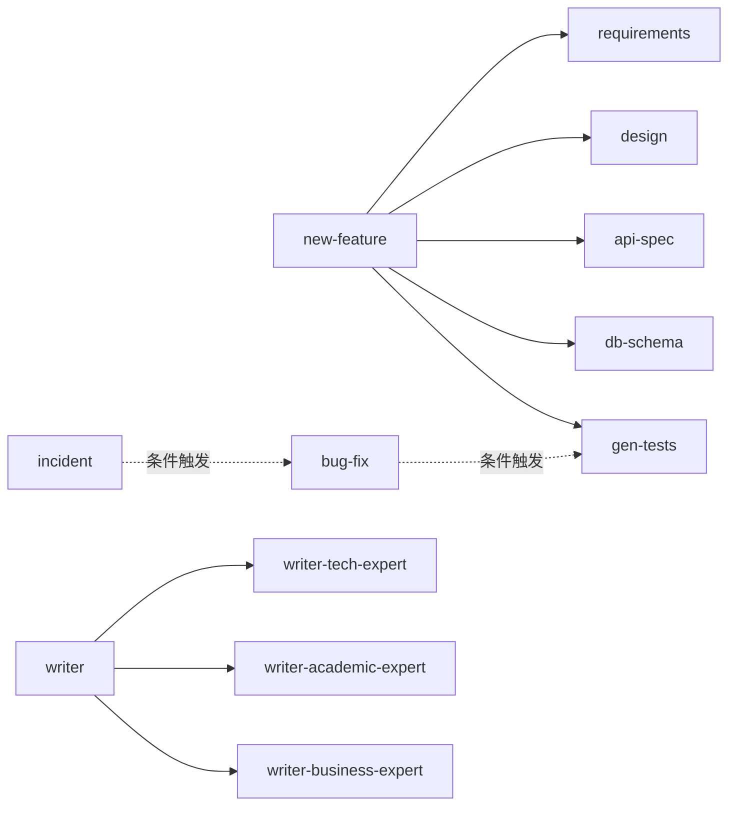

# 02 - Skill 互相调用分析

> 核心问题：**Skill A 真的能"调用" Skill B 吗？怎么判断？**

---

## 🔑 先纠正一个常见误解

**Skill 之间没有"函数调用"机制**。它们不是 import / require 关系。

真正发生的事情是这样的：

```
用户说："帮我做新功能"
   ↓
宿主 Agent（Claude Code / Copilot）扫描所有 Skill 的 description
   ↓
发现匹配："new-feature" 的 description 含"做一个新功能"
   ↓
加载 new-feature 的 SKILL.md 进入上下文
   ↓
SKILL.md 里写："本流程需要配合 requirements、design、api-spec、db-schema 一起使用"
   ↓
Agent 又把后面这 4 个 Skill 的 SKILL.md 也加载进上下文
   ↓
按编排顺序执行
```

**所以"调用"=描述里的引用提示+宿主 Agent 的二次加载**，不是代码级跳转。

---

## 🧭 三种"调用"模式识别

### 模式 A：显式编排（Orchestrator 模式）

SKILL.md 里直接列出依赖：

```markdown
## 工作流

本工作流串联以下 Skill：

1. requirements - 收集需求
2. design - 出设计方案  
3. api-spec - 生成 API 文档
4. db-schema - 设计数据库
5. gen-tests - 补全测试

请按顺序激活上述 Skill。
```

**特征**：
- ✅ 明确点名其它 Skill
- ✅ 给出顺序
- ✅ 通常自身只是"指挥官"，不做实际工作

**例子**：本仓库 `c:\Users\John\.claude\skills\new-feature\SKILL.md` 和 `writer/SKILL.md` 就是这种模式。

### 模式 B：条件触发（Implicit 模式）

SKILL.md 里只写**用户场景**，依赖宿主 Agent 自己识别：

```markdown
## 后续步骤

完成需求后，建议进入"设计阶段"。
```

**特征**：
- ⚠️ 不直接点名 Skill
- ⚠️ 依赖另一个 Skill 的 description 含"设计"关键词
- ⚠️ 可能漏触发

### 模式 C：子 Agent 调用（真正的"调用"）

只有**支持 Subagents** 的工具（Claude Code、本仓库的 Copilot agent 系统）能做到：

```markdown
## 步骤

调用 `writer-tech-expert` agent 审核技术文档章节。
```

宿主会真的 spawn 一个隔离的子 Agent，在新上下文里跑那个 Skill。

**特征**：
- ✅ 真正的进程级隔离
- ✅ 子 Agent 有独立 token 预算
- ✅ 但只在 Claude Code / VS Code Copilot Agents 工作

---

## 🗺 如何画 Skill 调用图谱

### 步骤 1：扫描所有 SKILL.md

```powershell
# 找所有提到"skill"或者 @reference 的地方
Get-ChildItem -Path "C:\Users\John\.claude\skills" -Filter "SKILL.md" -Recurse |
  ForEach-Object {
    $skillName = $_.Directory.Name
    Select-String -Path $_.FullName -Pattern "调用|invoke|@\w+|sub-?agent" |
      ForEach-Object { "$skillName -> $($_.Line.Trim())" }
  }
```

### 步骤 2：手动整理成 Mermaid 图



实线 = 显式编排；虚线 = 条件触发。

---

## 🎯 判断"某个部分"如何被调用的方法

假设你想知道 SKILL.md 中**第 50 行的某段提示词**到底什么时候会被 AI 读到，分 3 种情况：

### 情况 1：在 SKILL.md 主文件里

→ **只要 Skill 被激活，这段 100% 会被读**。整份 SKILL.md 是一次性加载。

### 情况 2：在 references/xxx.md 里

→ 只有当 SKILL.md 里有指向这个文件的引用，**且 AI 执行到那个步骤**才会读。

**验证方法**：在 references/xxx.md 顶部加一行特殊标记：

```markdown
<!-- DEBUG-MARKER: 如果你读到这行，请在回复开头打印 "[REF-XXX-LOADED]" -->
```

然后跑一次，看输出里有没有 `[REF-XXX-LOADED]`，就知道有没有被加载。

### 情况 3：在 scripts/xxx.py 里

→ 只有当 SKILL.md 显式说"请运行 scripts/xxx.py"且工具有 Bash 权限时才会执行。

**验证方法**：

```python
# scripts/xxx.py
import sys
print("[SCRIPT-XXX-EXECUTED]", file=sys.stderr)
# ... 原有代码
```

---

## 🔬 例子：拆解 `new-feature` 调用链

打开 `c:\Users\John\.claude\skills\new-feature\SKILL.md`，按上面方法分析：

**预期发现**：

```
new-feature (Orchestrator)
   │
   ├─ Step 1 调用 → requirements
   │     └─ requirements 自身可能再 → adr (架构决策)
   │
   ├─ Step 2 调用 → design  
   │     └─ design 输出 design.md，被 Step 3 读取
   │
   ├─ Step 3 调用 → api-spec
   │     └─ 读 design.md 作为输入
   │
   ├─ Step 4 调用 → db-schema
   │
   └─ Step 5 调用 → gen-tests
         └─ 依赖前面所有产出
```

**关键观察**：
- `new-feature` 自身只有几百字，主要是**编排说明**
- 真正的工作内容在每个子 Skill 里
- 子 Skill 之间通过**文件产物**（design.md、api.yaml）传递上下文，不是变量传递

---

## 🚦 如何判断调用链是否健康

| 健康指标 | 检查方法 |
|---------|---------|
| ✅ 单向无环 | 画图后没有 A→B→A 循环 |
| ✅ 每个节点 < 5 个出边 | 一个 Skill 不要依赖太多 |
| ✅ 深度 ≤ 3 层 | A→B→C→D 太深会失控 |
| ✅ 共享数据通过文件 | 不要假设变量能传递 |
| 🚩 循环依赖 | A 调 B，B 又调 A |
| 🚩 隐式依赖 | 没在 SKILL.md 里说明却暗中要求其它 Skill 存在 |

---

## 📝 小结

1. Skill 之间没有真正的代码调用，只有"宿主 Agent 协同加载"
2. 三种模式：显式编排 / 条件触发 / 子 Agent 调用
3. 用 grep + Mermaid 画依赖图，10 分钟搞定
4. 验证某段提示词是否生效，加 `<!-- DEBUG-MARKER -->` 打标签
5. 健康调用链：单向、浅层、文件传值
