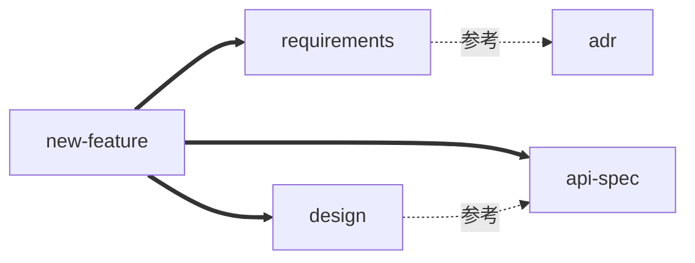

# 05 - 借助 AI 理解别人的 Skill（6 个 Prompt 模板）

> 智力低下的我们，最大武器就是**让 AI 把 AI 写的 Skill 翻译成人话**

---

## 🎯 核心思路

**Skill 是 AI 的提示词压缩包，那么用 AI 来解压它最合适。**

下面 6 个 Prompt 模板，按顺序用，能把任何陌生 Skill 拆解到你能改的程度。

---

## Prompt 1️⃣：一句话摘要（用于快速筛选）

```
我贴一份 SKILL.md 给你，请用 30 个汉字以内回答：

1. 这个 Skill 干什么？
2. 触发它的用户原话举 3 个例子
3. 不该用它的场景举 1 个例子

[贴 SKILL.md 全文]
```

**用途**：批量评估 10 个 Skill 时，先用这个过滤掉 70%。

**期望输出**：

```
1. 用途：生成 OpenAPI 3.1 规范
2. 触发：「设计接口」「写OpenAPI」「定义API规范」
3. 不适用：「调用某个已有 API」（那是另一个 skill）
```

---

## Prompt 2️⃣：结构化拆解（用于深度阅读）

```
请把下面这份 SKILL.md 拆成表格输出：

| 章节标题 | 行号范围 | 这一章的作用 | 是否依赖外部资源 |

如果某段内容引用了其它文件（references/、scripts/），单独列出引用列表。

[贴 SKILL.md 全文]
```

**用途**：替代你自己 grep 的工作，AI 一次性给出地图。

---

## Prompt 3️⃣：依赖图谱生成（用于编排型 Skill）

```
请阅读以下多份 SKILL.md，输出 mermaid 图，
节点是 skill 名，边是"显式调用"（实线）或"建议关联"（虚线）。

只用 mermaid 代码块输出，不要解释。

--- skill 1: new-feature ---
[内容]

--- skill 2: requirements ---
[内容]

--- skill 3: design ---
[内容]
```

**期望输出**：



---

## Prompt 4️⃣：质量打分（用 03 章清单）

```
按以下 30 项评分清单给这份 SKILL.md 打分，输出表格：

[粘贴 03-Skill质量评估清单.md 的清单部分]

待评估的 Skill：

[贴 SKILL.md 全文]

要求：
- 每项给出得分和一句话理由
- 最后给总分和一句话结论：建议采用 / 修改后采用 / 弃用
```

**用途**：让 AI 当审查员，避免你自己打分主观。

---

## Prompt 5️⃣：跨工具迁移（自动适配）

```
请把这份 Claude 格式的 Skill 改写为 [VS Code Copilot / OpenCode / Cursor / Gemini] 格式。

要求：
1. frontmatter 字段按目标工具规范调整
2. 正文内容保持等价
3. 触发关键词保留中英文
4. 在最后用 ⚠️ 标出无法 1:1 等价的地方

源 Skill:
[贴 SKILL.md 全文]
```

**用途**：节省你的 Frontmatter 改写时间。但**输出后必须人工 review**，AI 经常会自作主张删除字段。

---

## Prompt 6️⃣：定向追问（理解某个具体片段）

```
我看不懂下面 SKILL.md 中第 X 段的设计意图：

【片段】
[只贴有疑问的那段]

【上下文】
本 Skill 整体作用是 [一句话描述]

请回答：
1. 这一段在整个工作流的哪一步会被读到？
2. 作者为什么这样写？是不是有什么 corner case？
3. 如果删掉这段，最坏会发生什么？
4. 给一个改写建议（如果你觉得能改进）
```

**用途**：把"我看不懂"的疑惑精准发问，避免让 AI 重读全文。

---

## 🧪 完整示例：用 6 个 Prompt 分析 `bug-fix` skill

### 输入材料

```
c:\Users\John\.claude\skills\bug-fix\SKILL.md
```

### 流程演示

**Step 1（Prompt 1）**：

```
> 30 字摘要这份 SKILL.md
```

输出：

```
1. 深度分析 Bug 根因并给出修复方案
2. 触发：「修复bug」「报错了」「fix this error」
3. 不适用：纯代码解释（用 explain-code）
```

→ 决定继续看。

**Step 2（Prompt 2）**：

```
> 拆成章节表格
```

输出可能是：

| 章节 | 行号 | 作用 | 外部依赖 |
|------|------|------|---------|
| Frontmatter | 1-5 | 元数据 | 无 |
| 工作流总览 | 7-15 | 5 步流程 | 无 |
| Step 1: 收集错误 | 17-40 | 拿 stack trace | Read 工具 |
| Step 2: 复现 | 42-65 | 跑命令 | Bash 工具 |
| Step 3: 根因分析 | 67-100 | 提示词 | 无 |
| Step 4: 修复 | 102-130 | 改代码 | Edit 工具 |
| Step 5: 验证 | 132-150 | 跑测试 | Bash 工具 |
| 输出格式 | 152-180 | 模板 | 无 |

**Step 3（跳过，单文件无依赖）**

**Step 4（Prompt 4）**：让 AI 打分，得 70/100。

**Step 5（不需要适配，本地用）**

**Step 6（Prompt 6）**：

```
> 我看不懂"Step 3: 根因分析"中"5 Whys"那段，作者为什么强制 5 次？
```

AI 回答你之后，你就理解了，可以决定要不要保留这个约束。

---

## 💡 进阶技巧

### 技巧 1：用 AI 反向写测试用例

```
基于这份 SKILL.md，请生成 5 个用户输入，
其中 3 个应触发此 Skill，2 个应**不触发**（边界 case）。

[SKILL.md]
```

然后你拿这 5 句话去真实环境试，验证 description 写得准不准。

### 技巧 2：用 AI 找相似 Skill 去重

```
我有以下 5 个 Skill 的 description：
1. ...
2. ...

请聚类，找出功能重叠的，并建议合并方案。
```

### 技巧 3：让 AI 模拟执行

```
假设用户输入"帮我修复这个 NullPointerException"，
请按这份 SKILL.md 的工作流逐步描述你会做什么、读什么文件、调什么工具。

[SKILL.md]
```

→ 这是**最强大的 Skill 验证手段**，相当于 dry-run。

---

## 📝 小结

| Prompt | 何时用 | 输出 |
|--------|-------|------|
| 1️⃣ 一句话摘要 | 批量筛选 | 30 字总结 |
| 2️⃣ 结构拆解 | 单 Skill 深度阅读 | 章节表格 |
| 3️⃣ 依赖图谱 | 多 Skill 编排 | Mermaid 图 |
| 4️⃣ 质量打分 | 决定 fork 与否 | 30 项评分 |
| 5️⃣ 跨工具迁移 | 移植到新工具 | 改写后的 Skill |
| 6️⃣ 定向追问 | 理解具体片段 | 设计意图解释 |

**记住**：AI 不是替你思考，是替你**整理 + 校对**。最终判断仍然你做。
