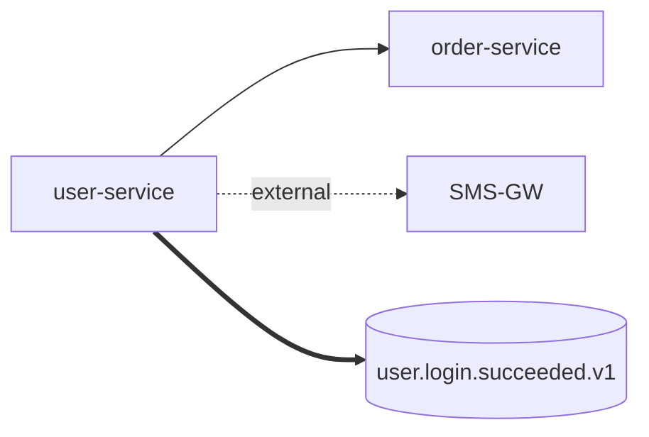

# 02 - 接口分类与连通一览设计

> 目标：在任意时刻一图回答 4 个问题：
> 1) 我对外暴露了哪些接口？2) 我依赖了哪些内部 / 外部接口？
> 3) 现在是否连通？4) 出了问题，谁负责？

---

## 1. 接口分类法（二维）

第一维：**信任域**
- A. 自身入口（Inbound-Self）：本服务对外暴露
- B. 内部下游（Outbound-Internal）：同信任域兄弟服务
- C. 外部下游（Outbound-External）：跨信任域三方服务
- D. 异步事件（Async）：MQ / Kafka / WebHook

第二维：**协议**
- HTTP/REST、gRPC、MQ、WebHook、SOAP（遗留）、SSE / WebSocket、文件协议（FTP/S3）

> 任一接口 = (信任域, 协议, 业务能力域) 三元组。

---

## 2. 接口清单：单一事实源

入仓位置：`docs/api/catalog.yaml`（人工维护 + 流水线校验）

```yaml
version: 1
services:
  - name: user-service
    owner: team-iam
    inbound:
      - id: USR-IN-001
        protocol: http
        spec: openapi/user-service-v1.yaml
        domain: 认证
    outbound-internal:
      - id: USR-OUT-I-001
        target: order-service
        protocol: http
        spec: openapi/order-service-v1.yaml
        purpose: 查询用户订单数（登录后首页）
        sla: { p95_ms: 150, timeout_ms: 800, retry: 1 }
    outbound-external:
      - id: USR-OUT-E-001
        target: SMS-GW (aliyun-dysms)
        protocol: http
        spec: contracts/external/aliyun-dysms-v2023.yaml
        purpose: 登录验证码下发
        sla: { p95_ms: 600, timeout_ms: 2000, retry: 0 }
        secrets: [SMS_AK, SMS_SK]
        circuit-breaker: { failure-rate: 50%, slow-call: 1500ms, window: 30s }
    async:
      - id: USR-EVT-001
        kind: kafka-producer
        topic: user.login.succeeded.v1
        schema: schemas/user.login.succeeded.v1.json
```

校验规则（CI）：
- 每个 inbound `spec` 必须存在且能被 OpenAPI parser 解析。
- 每个 outbound `target` 必须在另一个服务的 inbound 中能找到（内部）或在 `contracts/external/` 中存在（外部）。
- `owner` 必须在 `docs/owners.yaml` 中存在。
- 缺失 `sla` / `circuit-breaker` → 警告级；外部缺失 `secrets` → 阻塞。

---

## 3. 连通一览图（三层语义）

定义 **连通 = 网络可达 ∧ 协议可达 ∧ 业务可达**：

| 层 | 含义 | 探针 |
|---|---|---|
| L1 网络 | TCP/TLS 握手成功 | `Socket / TLS handshake` |
| L2 协议 | 拿到符合协议的响应（HTTP 2xx/4xx 都算） | `GET /actuator/health` 或自定义 ping |
| L3 业务 | 响应符合契约（schema 校验通过 + 关键字段非空） | 命名为 `*-smoke` 的契约用例 |

### 3.1 连通矩阵（运行期产出）

由 `connectivity-prober` 周期性扫描 `catalog.yaml` → 生成：

```
docs/api/connectivity-matrix.md          # 自动生成，PR 比对差异
```

矩阵示意：

| 源 → 目标 | 协议 | L1 | L2 | L3 | P95 | 错误率 | 最近探测 |
|----------|------|----|----|----|-----|--------|---------|
| user-service → order-service | http | ✅ | ✅ | ✅ | 120ms | 0.1% | 30s 前 |
| user-service → SMS-GW | http | ✅ | ✅ | ⚠️ | 1800ms | 3.2% | 30s 前 |
| user-service → kafka:user.login | mq | ✅ | ✅ | ✅ | 8ms | 0% | 30s 前 |

### 3.2 依赖图（结构产出）
由 `catalog.yaml` 生成 Mermaid，嵌入 `docs/api/dependency-graph.md`：



> 节点颜色按 owner 分组；边样式：实线=同步内部，虚线=外部，粗线=异步。

---

## 4. 探针设计（Connectivity Prober）

| 模式 | 触发 | 用途 |
|------|------|------|
| **构建期探针** | CI 每次流水线 | 验证契约文件完整性、引用闭环 |
| **环境就绪探针** | 部署后 / 定时 30s | L1 + L2 + L3 全检，喂连通矩阵 |
| **诊断探针（On-Demand）** | 故障时人工触发 | 单条接口加压 / 抓包 / 录制 |

实现要点（不写代码，仅约束）：
- 探针**只读**，禁止造成业务副作用（写接口用 `dry-run` / 影子账号）。
- 探针**复用契约用例**：`*-smoke` 自动用例 = L3 探针。
- 探针失败 ≥ 2 次连续 → 告警；连续 5 次 → 降级提示（在依赖图边变红）。

---

## 5. 接口元数据扩展（OpenAPI 扩展字段）

```yaml
paths:
  /v1/users/{id}:
    get:
      x-classification:
        trust: inbound-self
        criticality: P0           # P0/P1/P2
        idempotent: true
        readonly: true
      x-owners: [team-iam]
      x-sla: { p95_ms: 80, timeout_ms: 500 }
      x-test-data-ref: fixtures/user/basic.json   # 见 05
      x-mock-ref: mocks/user-service/get-user.json
```

CI 校验：
- `criticality=P0` 接口 → 必须有 ≥ 3 条用例（含异常路径）+ 必须有连通探针
- `readonly=false` → 必须声明幂等键策略（`idempotent`/`Idempotency-Key`）

---

## 6. 一览看板（建议落地形式）

| 看板 | 来源 | 形式 |
|------|------|------|
| 接口总目录 | `catalog.yaml` 渲染 | 静态站点 / Backstage 插件 |
| 依赖图 | mermaid 自动生成 | Markdown 嵌入 |
| 连通矩阵 | 探针实时数据 | Grafana + 表格 |
| 契约变更日志 | `git log` + 差异脚本 | CHANGELOG-API.md |
| 责任地图 | `owners.yaml` + 接口归属 | 可点击跳转 IM 群 |

---

## 7. 评审清单

- [ ] `catalog.yaml` 是否作为强制单一事实源（vs Apifox / YAPI）
- [ ] 三层连通语义是否被运维 / 业务共同认可
- [ ] 探针频率（30s）与成本是否平衡
- [ ] 外部依赖是否要在 catalog 中标注合同到期日 / 计费口径
